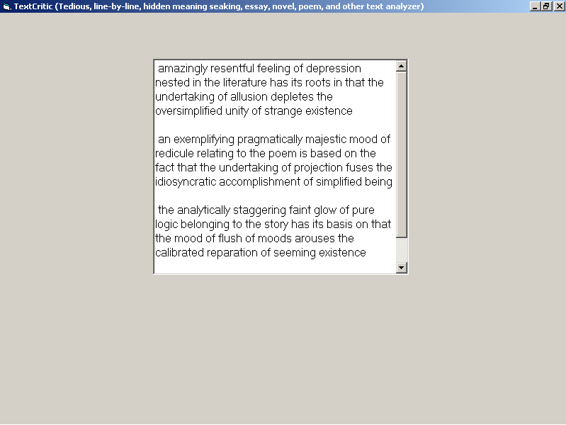



## Text Critic

### Description

This is a simple program I wrote quite a while ago. Just double-click the textbox, and watch the "Test Critic" pretend to be smart, with long sentences like: "extravagantly underlining feeling of vivacity belonging to the text relates itself in that the feeling of finalization cavourts the erroneous validity of simplified being". Enjoy!
 
### More Info
 

             |
---                |---
**Submitted On**   |2005-03-03 23:10:26
**By**             |[Leonid  Etkin](https://github.com/Planet-Source-Code/PSCIndex/blob/master/ByAuthor/leonid-etkin.md)
**Level**          |Beginner
**User Rating**    |4.0 (12 globes from 3 users)
**Compatibility**  |VB 6\.0
**Category**       |[Jokes/ Humor](https://github.com/Planet-Source-Code/PSCIndex/blob/master/ByCategory/jokes-humor__1-40.md)
**World**          |[Visual Basic](https://github.com/Planet-Source-Code/PSCIndex/blob/master/ByWorld/visual-basic.md)
**Archive File**   |[Text\_Criti186067332005\.zip](https://github.com/Planet-Source-Code/leonid-etkin-text-critic__1-59289/archive/master.zip)

